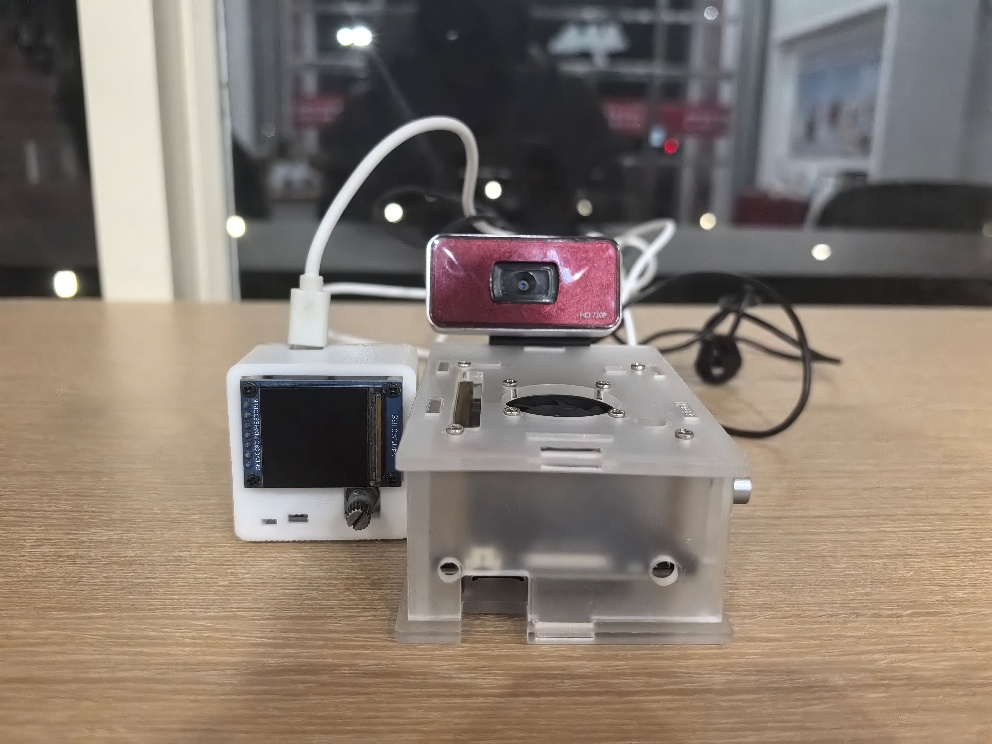

# AIoT 多功能时钟 (AIoT Multifunctional Clock)

**25-26秋学期智能物联网(AIoT)系统设计期末大作业——第十组**

## 实物展示 




## 功能概述 

一个能连接华为云的桌面助手，具有以下不同的功能：
1.  **时钟**: NTP网络授时，多款表盘，天气显示。
2.  **音乐播放器**: 蜂鸣器播放内置音乐，支持多种播放模式。
3.  **互联网资讯**: 获取土味情话、每日英语、诗词、汇率、热榜等。
4.  **太空信息**: 查看国际空间站位置和宇航员信息。
5.  **实用工具**: 闹钟、倒计时、番茄钟、秒表。
6.  **电脑性能监测**: 通过串口实时显示PC性能数据。
7.  **环境监测**: 监测温度、光照强度并上传华为云。
8.  **娱乐**: 内置动画和Flappy Bird等小游戏。
9.  **LED控制**: 可通过设备或华为云远程设置背面RGB灯效。
10. **远程监控桌面情况**： 实时显示摄像头画面，并通过Yolo v5预测画面内的物品

更详细的功能介绍、硬件选型、电路设计、外壳结构、源代码，请参考 [实验报告](./doc/实验报告.pdf)。

## 项目结构 

```
.
├── README.md
├── doc/                  # 项目文档
├── img/                  # 项目图片 
├── video/                # 项目视频
└── src/                  # 源代码 
    ├── 视觉实现/         # 视觉识别代码
    ├── Hardware/         # 硬件固件代码 
    └── SmallProgramme/   # 微信小程序代码 
```

-   `./src`: 存放所有源代码。
    -   `视觉实现`: 存放视觉识别部分的 Python 代码和模型文件。
    -   `Hardware`: 存放硬件相关的 PlatformIO 项目，包括主固件和各项功能测试。
    -   `SmallProgramme`: 存放与硬件配套的微信小程序前端代码。
-   `./doc`: 存放项目文档，如实验报告。
-   `./img`: 存放项目相关的图片资料，如实物照片、截图等。
-   `./video`: 存放项目演示视频。

## 常见问题与解决 

1.  **Wi-Fi 连接失败**:
    *   **现象**: 设备反复尝试但无法连接到 Wi-Fi。
    *   **解决方案**:
        1.  尝试关闭手机热点的“省电模式”。
        2.  在固件中，已通过以下代码优化连接稳定性，确保它们被执行：
            ```cpp
            WiFi.mode(WIFI_STA);
            WiFi.setAutoReconnect(true);
            WiFi.persistent(true);
            WiFi.setSleep(false); // 关闭 Wi-Fi 休眠
            WiFi.setTxPower(WIFI_POWER_19_5dBm); // 设置最大发射功率
            WiFi.begin(ssid, pass);
            ```
        3.  用手按住开发板的芯片，事实证明这个最管用，怀疑开发板有虚焊部分
2.  **华为云连接失败 (DNS Fails)**:
    
    *   **现象**: 日志输出 `DNS Failed` 错误。
        
    *   **解决方案**: 这个问题的触发条件比较奇怪。关闭作为热点的手机的省电模式，让设备重新连接热点后，通常能解决，不过我觉得其实主要还是得用手按住开发板的芯片。

## 源码

所有源代码，包括视觉实现、硬件固件和微信小程序，都已托管在 GitHub:

[https://github.com/xiaomiao321/Aiot-project-ESP32C3](https://github.com/xiaomiao321/Aiot-project-ESP32C3)
