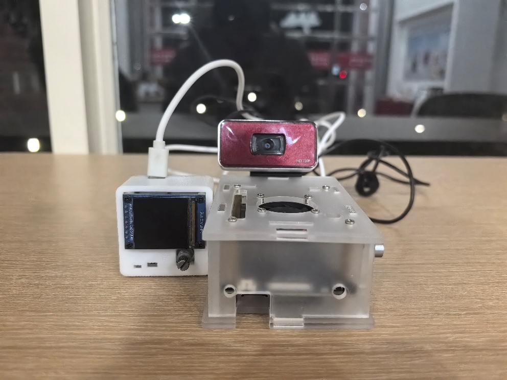
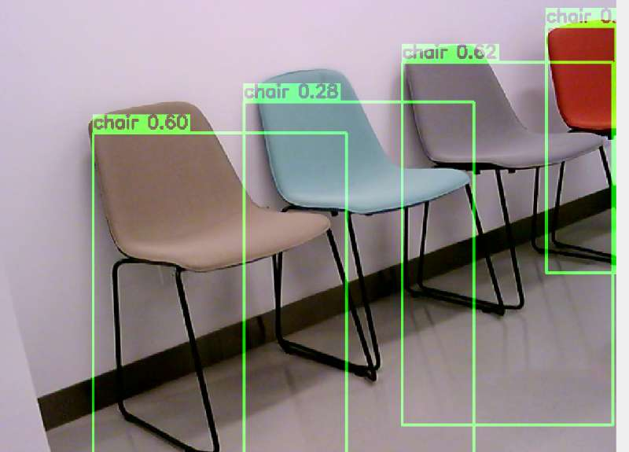
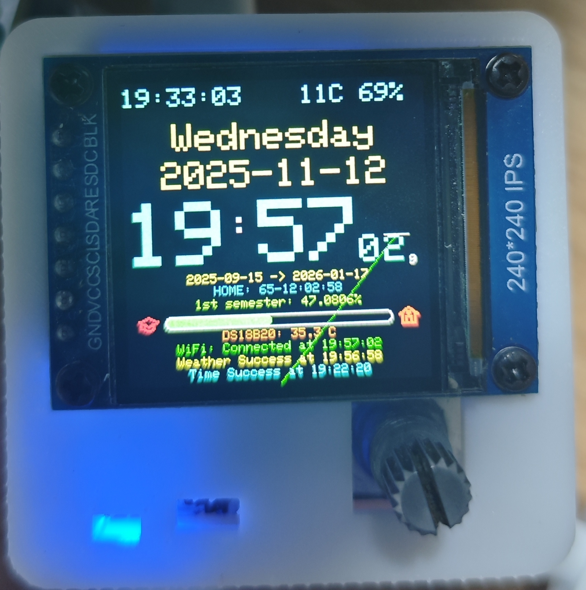
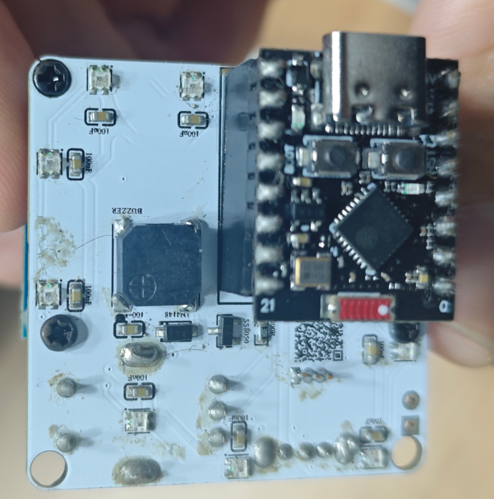

# AIoT Multifunctional Clock

**Final Project for Intelligent IoT (AIoT) System Design Course — Group 10**

[中文版本](./README.zh.md) | **English Version**

## Project Showcase








## Overview

A desktop assistant powered by ESP32-C3 and Huawei Cloud IoT, featuring:

1. **Clock**: NTP time synchronization, multiple watch faces, weather display
2. **Music Player**: Buzzer playback with built-in songs, multiple playback modes
3. **Internet Services**: Fetches quotes, daily English, poetry, exchange rates, trending topics, and more
4. **Space Information**: Real-time ISS location and astronaut data
5. **Utilities**: Alarm, countdown, Pomodoro timer, stopwatch
6. **PC Performance Monitoring**: Real-time CPU/GPU/RAM usage via USB serial
7. **Environmental Monitoring**: Temperature and light intensity with Huawei Cloud upload
8. **Entertainment**: Built-in animations and games (Flappy Bird, etc.)
9. **LED Control**: RGB lighting effects controllable via device or Huawei Cloud
10. **Remote Desktop Monitoring**: Real-time camera feed with YOLOv5 object detection

For detailed functionality, hardware design, circuit schematics, and source code, please refer to the [Project Report](./doc/Project_Report.pdf).

## Features

### Environmental Sensing
- Temperature and light intensity monitoring via sensors
- Data uploaded to Huawei Cloud IoTDA platform
- Real-time camera feed with YOLOv5 object detection
- Object recognition provides user engagement and potential safety warnings

### Mood Enhancement
- Music playback with 88 built-in songs
- Dynamic RGB lighting effects
- Fun animations and simple games
- Designed to provide stress relief during work/study breaks

### Productivity Tools
- Clock with NTP synchronization and 17 watch face styles
- Pomodoro timer (25min work / 5min break cycles)
- Countdown and stopwatch functions
- PC performance monitoring (CPU/GPU/RAM)
- Real-time information feeds (news, weather, quotes)

### Detailed Features

#### Vision Module
Real-time camera display with YOLOv5 object detection. Enables remote desktop monitoring and provides emotional value through object recognition. *(Note: The planned warning system for detecting hazardous objects via Huawei Cloud push notifications was not implemented due to time constraints.)*

#### ESP32 Module

| Feature | Description |
|---------|-------------|
| **Clock** | NTP sync via `ntp.aliyun.com`, RTC backup, 17 watch faces, weather display |
| **Music** | 88 built-in songs, playback modes (single/playlist/random), RGB sync, controllable via WeChat Mini Program |
| **Internet** | 20 sub-menus: quotes, English learning, poetry, exchange rates, GitHub trending, stock prices (AMD, Apple, NVIDIA, Tesla, Microsoft, Intel), etc. |
| **Space** | ISS astronaut count/names and real-time coordinates |
| **Alarm** | Device-side and remote setup via WeChat Mini Program |
| **Countdown** | Standard countdown functionality |
| **Pomodoro** | Standard Pomodoro technique (25+5 min cycles) |
| **Stopwatch** | Standard stopwatch functionality |
| **PC Monitor** | CPU/GPU temperature & load, RAM usage via USB serial |
| **Temperature** | DS18B20 sensor with gauge display, cloud upload |
| **Light** | Photoresistor with gauge display, cloud upload |
| **LED** | WS2812 RGB control (single/all/rainbow modes), cloud remote control |
| **Games** | Conway's Game of Life, reaction game, timing game, Flappy Bird |

### Built-in Music List (88 Songs)

| ID | Song Title | Artist / Composer |
|----|------------|-------------------|
| 0 | 爱你 | Wang Xinling |
| 1 | 爱情讯息 | Eason Chan |
| 2 | 啊朋友再见 | Traditional |
| ... | ... | ... |
| 16 | 稻香 | Jay Chou |
| 23 | Fate | Ludwig van Beethoven |
| 31 | 光辉岁月 | Beyond |
| 54 | 七里香 | Jay Chou |
| 60 | Shape Of You | Ed Sheeran |
| 68 | Turkish March | Wolfgang Amadeus Mozart |
| 87 | Windows XP | Microsoft |

*(Full list available in the source code)*

## System Architecture

```
┌─────────────────────────────────────────────────────────────────┐
│                        Cloud-Edge-End Architecture               │
├─────────────────────────────────────────────────────────────────┤
│                                                                  │
│  ┌──────────────┐     ┌──────────────┐     ┌──────────────┐    │
│  │   End Device │────▶│  Edge Node   │────▶│  Cloud Platform│   │
│  │   (ESP32-C3) │     │ (Orangepi 5) │     │ (Huawei IoTDA)│   │
│  │              │     │              │     │               │   │
│  │ • Sensors    │     │ • YOLOv5     │     │ • Device Mgmt │   │
│  │ • Display    │     │ • Vision     │     │ • Data Storage│   │
│  │ • Actuators  │     │ • Processing │     │ • API Access  │   │
│  └──────────────┘     └──────────────┘     └──────────────┘   │
│         │                      │                      │        │
│         └──────────────────────┴──────────────────────┘        │
│                                │                               │
│                       ┌────────▼────────┐                      │
│                       │  User Terminal  │                      │
│                       │  (WeChat App)   │                      │
│                       └─────────────────┘                      │
└─────────────────────────────────────────────────────────────────┘
```

## Project Structure

```
.
├── README.md               # Project overview (English)
├── README.zh.md            # Project overview (Chinese)
├── LICENSE                 # MIT License
├── doc/                    # Project documentation
│   ├── Project_Report.pdf  # Detailed project report
│   └── Technical_Doc.md    # Technical documentation
├── img/                    # Project images
├── video/                  # Demo videos
└── src/                    # Source code
    ├── Vision/             # Vision recognition (Python/YOLOv5)
    ├── Hardware/           # Hardware firmware (PlatformIO/C++)
    └── SmallProgramme/     # WeChat Mini Program frontend
```

### Directory Details

| Directory | Contents |
|-----------|----------|
| `src/Vision/` | Python code and model files for YOLOv5 object detection |
| `src/Hardware/` | PlatformIO project for ESP32-C3 firmware |
| `src/Hardware/Weather_Clk_PlatformIO/` | Main firmware with all features |
| `src/Hardware/Test_*/` | Independent test projects for specific modules |
| `src/SmallProgramme/` | WeChat Mini Program for remote control |
| `doc/` | Project report and technical documentation |
| `img/` | Photos of the device, screenshots, and diagrams |
| `video/` | Demo videos |

## Hardware Specifications

### Vision Module
| Component | Specification |
|-----------|---------------|
| Camera | HD 720p |
| Board | Orangepi 5 Ultra (RK3588) |
| OS | Ubuntu 24.04 |
| Architecture | ARM |
| Environment | Python 3.10 (Conda) |

### ESP32 Module
| Component | Specification |
|-----------|---------------|
| MCU | ESP32-C3-SuperMini |
| Display | 1.69" TFT (240×280) |
| Temperature | DS18B20 |
| Light | Photoresistor GT36528 |
| Input | EC11 Rotary Encoder |
| Audio | MLT-7525 Buzzer |
| LED | WS2812 RGB |
| Power | USB 5V |

## WeChat Mini Program & Huawei Cloud Integration

The project uses a WeChat Mini Program for remote monitoring and control. The Mini Program communicates with Huawei Cloud IoTDA platform via HTTPS APIs.

### Interaction Flow

```
User → WeChat Mini Program → Huawei Cloud IAM (Auth) → Huawei Cloud IoTDA → ESP32 Device
```

### Core Features

| Feature | Description |
|---------|-------------|
| **Device Monitoring** | Real-time display of temperature, light, PC performance data |
| **LED Control** | Remote RGB color/mode control (single/all/rainbow/off) |
| **Music Control** | Remote song selection from 88 built-in tracks |
| **Alarm Setting** | Remote alarm configuration with time/day settings |

### API Endpoints

| Service | Endpoint | Method |
|---------|----------|--------|
| IAM Auth | `POST https://iam.cn-east-3.myhuaweicloud.com/v3/auth/tokens` | POST |
| Device Shadow | `GET https://{endpoint}/v5/iot/{projectId}/devices/{deviceId}/shadow` | GET |
| Command | `POST https://{endpoint}/v5/iot/{projectId}/devices/{deviceId}/commands` | POST |

## Quick Start

### Prerequisites

- **ESP32-C3**: PlatformIO, ESP32 Arduino Core
- **Vision**: Python 3.10, OpenCV, ONNX, RKNN-Toolkit2
- **Mini Program**: WeChat Developer Tools

### Build & Upload (ESP32)

```bash
# Navigate to the main firmware directory
cd src/Hardware/Weather_Clk_PlatformIO

# Build and upload
pio run --target upload
```

### Run Vision Module (Orangepi)

```bash
# Activate conda environment
conda activate aienv

# Run the vision script
python src/Vision/main.py
```

### Deploy Mini Program

1. Open `src/SmallProgramme/Huawei_IOT_Wechat/` in WeChat Developer Tools
2. Configure your Huawei Cloud credentials in `config.js`
3. Compile and preview

## Common Issues & Solutions

### 1. Wi-Fi Connection Failure
**Symptom**: Device repeatedly fails to connect to Wi-Fi.

**Solutions**:
1. Disable "Power Saving Mode" on your mobile hotspot
2. Ensure the following code is executed in firmware:
   ```cpp
   WiFi.mode(WIFI_STA);
   WiFi.setAutoReconnect(true);
   WiFi.persistent(true);
   WiFi.setSleep(false);  // Disable Wi-Fi sleep
   WiFi.setTxPower(WIFI_POWER_19_5dBm);  // Max transmit power
   WiFi.begin(ssid, pass);
   ```
3. Press firmly on the ESP32 chip (may indicate cold solder joints)

### 2. Huawei Cloud Connection Failure (DNS Error)
**Symptom**: `DNS Failed` error in logs.

**Solution**: Disable power saving mode on the hotspot phone. Pressing the ESP32 chip may also help.

## Performance Metrics

| Metric | Target | Achieved |
|--------|--------|----------|
| Wi-Fi Connection Time | < 5s | ~3s |
| NTP Sync Latency | < 1s | ~200ms |
| MQTT Latency | < 2s | ~500ms |
| Sensor Upload Rate | 1/s | 1/s |
| Music Response | < 1s | ~300ms |
| LED Control Response | < 2s | ~800ms |

## Challenges & Future Work

### Challenges Encountered
1. **Hardware**: AHT20 sensor and FPC display soldering difficulties
2. **Environment**: Python dependency conflicts on ARM Linux
3. **Integration**: Memory management and task synchronization on ESP32

### Future Improvements
1. **AI Warning System**: Complete the object detection warning loop via Huawei Cloud
2. **Data Visualization**: Add historical data charts in the Mini Program
3. **Third-party Services**: Integrate Google Calendar, Microsoft To-Do
4. **Voice Control**: Add voice command support
5. **Product Design**: Optimize enclosure and PCB for standalone battery operation

## License

This project is licensed under the [MIT License](LICENSE).

## Acknowledgments

- **Instructors**: Lou Dongwu / Qi Chenglin
- **Platform**: Huawei Cloud IoTDA
- **Libraries**: TFT_eSPI, PubSubClient, YOLOv5, OpenCV

## Repository

All source code (Vision, Hardware firmware, WeChat Mini Program) is available on GitHub:

**[xiaomiao321/Aiot-project-ESP32C3](https://github.com/xiaomiao321/Aiot-project-ESP32C3)**

---

*For academic inquiries, please contact the authors via the GitHub repository.*
