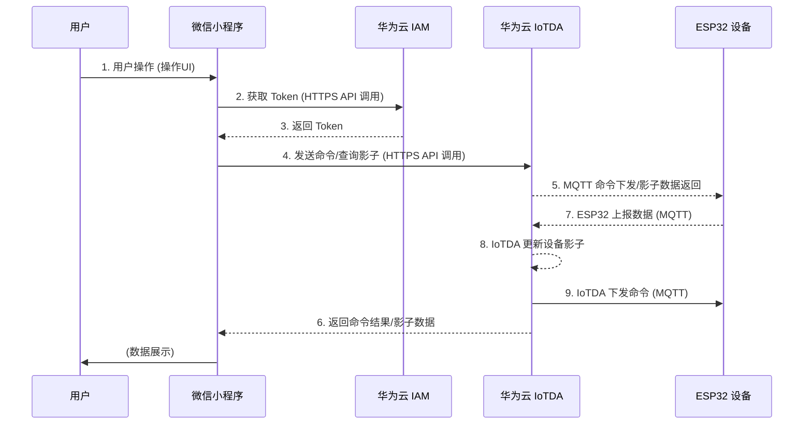

<div class="cover" style="break-after:page;font-family:方正公文仿宋;width:100%;height:100%;border:none;margin: 0 auto;text-align:center;">
    <div style="width:60%;margin: 0 auto;height:0;padding-bottom:10%;">
        </br>
        
    </div>
    </br></br></br></br></br>
    <div style="width:60%;margin: 0 auto;height:0;padding-bottom:40%;">
        
	</div>
    </br></br></br></br></br></br></br></br>
    <span style="font-family:华文黑体Bold;text-align:center;font-size:20pt;margin: 10pt auto;line-height:30pt;">《智能物联网（AIot）系统设计大作业实验报告》</span>
    </br>
    </br>
    <table style="border:none;text-align:center;width:72%;font-family:仿宋;font-size:14px; margin: 0 auto;">
    <tbody style="font-family:方正公文仿宋;font-size:12pt;">
    	<tr style="font-weight:normal;"> 
    		<td style="width:20%;text-align:right;">题　　目</td>
    		<td style="width:2%">：</td> 
    		<td style="width:40%;font-weight:normal;border-bottom: 1px solid;text-align:center;font-family:华文仿宋">AIoT系统设计大作业实验报告</td>     </tr>
    	<tr style="font-weight:normal;"> 
    		<td style="width:20%;text-align:right;">授课教师</td>
    		<td style="width:2%">：</td> 
    		<td style="width:40%;font-weight:normal;border-bottom: 1px solid;text-align:center;font-family:华文仿宋">楼东武/綦成林 </td>     </tr>
    	<tr style="font-weight:normal;"> 
    		<td style="width:20%;text-align:right;">姓　　名</td>
    		<td style="width:2%">：</td> 
    		<td style="width:40%;font-weight:normal;border-bottom: 1px solid;text-align:center;font-family:华文仿宋">何辰阳/苗翔宇</td>     </tr>
    	<tr style="font-weight:normal;"> 
    		<td style="width:20%;text-align:right;">学　　号</td>
    		<td style="width:2%">：</td> 
    		<td style="width:40%;font-weight:normal;border-bottom: 1px solid;text-align:center;font-family:华文仿宋">3240104411/3240101943 </td>     </tr>
    	<tr style="font-weight:normal;"> 
    		<td style="width:20%;text-align:right;">日　　期</td>
    		<td style="width:2%">：</td> 
    		<td style="width:40%;font-weight:normal;border-bottom: 1px solid;text-align:center;font-family:华文仿宋">2025.11.13</td>     </tr>
    </tbody>              
    </table>
</div>


---

[TOC]

---

## 团队成员分工与贡献

本项目由团队成员协作完成，具体分工与贡献说明如下：

| 成员 | 主要负责模块 | 具体工作内容 | 贡献度 |
| :--- | :--- | :--- | :--- |
| **苗翔宇** | **ESP32 物联网终端 & 云平台** | 1. 负责整体硬件方案设计、PCB绘制与制作。<br>2. 负责ESP32主控固件的全部功能开发，包括时钟、传感器数据采集、外设驱动等。<br>3. 负责华为云IoTDA平台的对接与调试。<br>4. 负责配套微信小程序的设计与开发，实现完整的云端控制链路。 | 60% |
| **何辰阳** | **香橙派边缘视觉系统** | 1. 负责香橙派的系统环境配置与开发环境搭建。<br>2. 负责实现基于YOLOv5的实时目标检测功能。<br>3. 负责视觉模块与系统的集成、调试及最终效果呈现。 | 40% |

---

## 课题背景

​	在信息化与智能化高度发展的时代背景下，人们的工作与生活节奏不断加快，长期处于高强度、快节奏的工作环境中。随之而来的注意力管理、心理健康等问题逐渐受到大众的关注。现代社会中，办公与学习场景高度依赖电子设备，但传统桌面工具功能单一、缺乏情绪关怀，难以在高效工作的同时提供舒缓与陪伴作用。随着物联网、人工智能与云计算技术的成熟，桌面智能助手的出现为这一现实需求提供了可行的解决方案。此类设备不仅能集成时间管理、信息提醒、环境监测等实用功能，还可多模态交互方式，营造舒适的办公氛围，帮助用户缓解心理压力、提高专注度与情绪稳定性。研究与开发面向多场景应用的桌面智能助手，不仅具有明显的实用意义，也契合了当前人们追求高效、健康、舒适生活方式的社会需求。

---

## 产品目的

​	探索桌面智能助手在信息服务与人机交互领域的创新实现方式。项目的核心目标是构建一个集时间管理、信息获取、环境感知与情绪调节于一体的智能化系统，以满足现代人对高效工作、健康生活和便捷交互的综合需求。通过硬件与云端平台的协同运行，实现数据的实时传输与多功能集成，使桌面设备不仅具备信息展示与提醒功能，还能通过多样化的交互方式提升用户体验与使用乐趣。

---

## 实物展示

整体


正面


背面


---

## 功能概述

### 环境感知

通过光敏传感器、温度传感器对环境的温度等信息进行感知，并可以通过华为云物联网平台在微信小程序上进行查看。该功能旨在使使用者实现更为便利的环境相关信息获取。通过相机获取实时图像，在PC端显示实时视频。并通过yolo v5实现对环境中物体的实时预测。该功能旨在将人工智能手段介入嵌入式物联网系统，使使用者可以远程查看办公桌面情况。Yolo预测功能给正在办公的使用者提供情绪价值并可以在出现危险物品的特殊情况下做出预警。（预警功能因时间原因与python代码的华为云连接等问题最终未能实现，希望在未来得到完善）

### 舒缓心情

该产品考虑了现代办公人群在长期高压环境下的心理调节需求。桌面助手通过音乐播放、动态灯光、趣味动画以及简易游戏等功能，能够在用户繁忙的工作间隙提供轻松愉悦的体验。例如，音乐功能可通过柔和旋律和可视化频谱动画帮助使用者舒缓情绪、缓解紧张；LED灯光系统可根据用户喜好调整颜色与亮度，营造舒适的桌面氛围；小游戏模块则为用户提供了短暂放松与情绪释放的途径。

### 助力办公

本项目在设计中充分考虑了办公与学习场景下的效率需求，通过多种智能化功能的集成实现了对时间管理与信息获取的优化。设备具备时钟、番茄钟、GPU&CPU检测等多种时间管理功能，能够帮助使用者科学规划工作、检测电脑，提升专注度与自律性；同时，通过网络接口获取新闻、英语词汇等实时信息，使用户在不依赖手机或电脑的情况下即可获得所需数据，减少工作中的信息切换与干扰。多项功能的有机结合，使该智能桌面助手不仅是信息展示终端，更是工作流程中的高效辅助工具，能有效提升任务执行效率与环境感知能力，为现代化智能办公提供了新的解决思路。

### 具体介绍

#### 视觉部分


实时显示摄像头画面，并通过Yolo v5预测画面内的物品。旨在使使用者可以远程监控桌面情况。Yolo的预测结果可以给正在办公的使用者提供情绪价值，并可以在出现危险物品的特殊情况下做出预警。（预警功能的设想是在预测的同时实时对识别的物体进行记录，并上传到华为云物联网平台，如出现家中有猫或狗上桌等情况，可能破坏桌面电子设备，则由华为云平台通过微信小程序进行预警，但由于时间原因最终未能实现）

#### ESP32部分

1. [时钟](#时钟)
2. [音乐](#音乐)
3. [互联网](#互联网)
4. [太空](#太空)
5. [闹钟](#闹钟)
6. [倒计时](#倒计时)
7. [番茄钟](#番茄钟)
8. [秒表](#秒表)
9. [简洁音乐](#简洁音乐)
10. [电脑性能监测](#电脑性能监测)
11. [温度监测](#温度监测)
12. [动画](#动画)
13. [游戏](#游戏)
14. [光照监测](#光照监测)
15. [LED设置](#led设置)

下面逐一进行介绍。

##### 时钟

通过NTP协议连接阿里云NTP服务器`ntp.aliyun.com`同步网络时间，并由RTC模块维持走时。此外，设备能通过高德地图API获取实时天气信息，并提供了十七个不同风格的表盘可供用户选择。

##### 音乐

使用板载无源蜂鸣器播放预置的单音轨音乐。播放界面可显示时长进度条、当前音符的频率和时长，以及频率随时间变化的动态图像。设备背面的彩色LED会同步呈现彩虹灯效。

用户不仅可通过旋转编码器进行本地操作（如暂停/继续、切换播放模式），还可以通过微信小程序远程点播歌曲。小程序通过华为云平台下发指令，允许用户从88首内置乐曲中选择任意一首进行播放，并可指定播放时屏幕的UI模式（全功能/简洁/无UI）。设备内置的播放模式包括单曲循环、列表循环和随机播放。设备内置88首乐曲，列表如下：

| ID  | 歌名                 | 演唱者 / 作曲者             |
|-----|----------------------|------------------------------|
| 0   | 爱你                 | 王心凌                      |
| 1   | 爱情讯息             | 陈奕迅                      |
| 2   | 啊朋友再见           | 无                          |
| 3   | 把回忆拼好给你       | 王贰浪                      |
| 4   | 保卫黄河             | 冼星海                      |
| 5   | 不得不爱             | 潘玮柏                      |
| 6   | 不再犹豫             | Beyond                      |
| 7   | 猜不透               | 丁当                        |
| 8   | 卡萨布兰卡           | Bertie Higgins              |
| 9   | 测谎                 | 薛之谦                      |
| 10  | 成都                 | 赵雷                        |
| 11  | 虫儿飞               | 黑鸭子                      |
| 12  | Counting Stars       | OneRepublic                 |
| 13  | 倒数                 | 蔡依林                      |
| 14  | 春娇与志明           | 五月天                      |
| 15  | 大海                 | 张雨生                      |
| 16  | 稻香                 | 周杰伦                      |
| 17  | 东方红               | 李有源                      |
| 18  | 东方之珠             | 罗大佑                      |
| 19  | 东西                 | 薛之谦                      |
| 20  | 梦中的婚礼           | Richard Clayderman          |
| 21  | 多远都要在一起       | 邓紫棋                      |
| 22  | 反方向的钟           | 周杰伦                      |
| 23  | Fate                 | Ludwig van Beethoven        |
| 24  | Five Hundred Miles   | The Innocence Mission       |
| 25  | For Elise            | Ludwig van Beethoven        |
| 26  | For Ya               | 来自网络                    |
| 27  | 富士山下             | 陈奕迅                      |
| 28  | 告白气球             | 周杰伦                      |
| 29  | 刚好遇见你           | 李玉刚                      |
| 30  | 歌唱祖国             | 王莘                        |
| 31  | 光辉岁月             | Beyond                      |
| 32  | 过火                 | 张信哲                      |
| 33  | 海阔天空             | Beyond                      |
| 34  | 荷塘月色             | 凤凰传奇                    |
| 35  | 红豆                 | 王菲                        |
| 36  | 红色高跟鞋           | 蔡健雅                      |
| 37  | 后来                 | 刘若英                      |
| 38  | 花海                 | 周杰伦                      |
| 39  | 江南                 | 林俊杰                      |
| 40  | 开始懂了             | 孙燕姿                      |
| 41  | 可不可以             | 张紫豪                      |
| 42  | 兰亭序               | 周杰伦                      |
| 43  | 梁祝                 | 何占豪 陈钢                 |
| 44  | 绿色                 | 陈雪凝                      |
| 45  | 明天会更好           | 群星                        |
| 46  | 南方姑娘             | 赵雷                        |
| 47  | 你若三冬             | 无                          |
| 48  | 怒放的生命           | 汪峰                        |
| 49  | Ode to Joy           | Ludwig van Beethoven        |
| 50  | 朋友                 | 周华健                      |
| 51  | 琵琶行               | 奇然                        |
| 52  | 平凡之路             | 朴树                        |
| 53  | 起风了               | 买辣椒也用券                |
| 54  | 七里香               | 周杰伦                      |
| 55  | 青花瓷               | 周杰伦                      |
| 56  | 晴天                 | 周杰伦                      |
| 57  | Radetzky Marsch      | Johann Strauss I            |
| 58  | 若水三千             | 无                          |
| 59  | 山丘                 | 李宗盛                      |
| 60  | Shape Of You         | Ed Sheeran                  |
| 61  | 十年                 | 陈奕迅                      |
| 62  | 送别                 | 李叔同                      |
| 63  | 素颜                 | 许嵩                        |
| 64  | Sugar                | Maroon 5                    |
| 65  | Take Me Hand         | 无                          |
| 66  | 天黑黑               | 孙燕姿                      |
| 67  | 童年                 | 罗大佑                      |
| 68  | Turkish March        | Wolfgang Amadeus Mozart     |
| 69  | 我怀念的             | 孙燕姿                      |
| 70  | 我是一只小小鸟       | 赵传                        |
| 71  | 喜欢你               | Beyond                      |
| 72  | 下个路口见           | 李宇春                      |
| 73  | 小苹果               | 筷子兄弟                    |
| 74  | 心墙                 | 郭静                        |
| 75  | 修炼爱情             | 林俊杰                      |
| 76  | 演员                 | 薛之谦                      |
| 77  | 一生有你             | 水木年华                    |
| 78  | 隐形的翅膀           | 张韶涵                      |
| 79  | 有点甜               | 汪苏泷                      |
| 80  | 遇见                 | 孙燕姿                      |
| 81  | 夜曲                 | 周杰伦                      |
| 82  | 鸳鸯戏               | 来自网络                    |
| 83  | 这世界那么多人       | 莫文蔚                      |
| 84  | 真的爱你             | Beyond                      |
| 85  | 追光者               | 岑宁儿                      |
| 86  | 最后一页             | 江语晨                      |
| 87  | Windows XP           | Microsoft                   |

##### 互联网

此功能模块集成了20个子菜单，通过调用各类公共API获取并展示各种有趣的信息，包括：

1. 土味情话
2. 每日英语
3. 每日运势
4. 随机诗词
5. 随机对联
6. USD/RMB汇率
7. 随机单词
8. 每日一言
9. 励志短句
10. 优美诗句
11. 天气诗词
12. EMO话语
13. 脑筋急转弯
14. 健康小贴士
15. Github热榜
16. 历史上的今天
17. 十万个为什么
18. 详细天气
19. 股票行情 (AMD, Apple, NVIDIA, TESLA, Microsoft, Intel)

    

20. 全球汇率 (API暂时存在问题)

##### 太空

从公共API获取与太空相关的数据，包括：
-   当前国际空间站（ISS）上的宇航员总人数及姓名。
-   当前国际空间站的实时经纬度坐标。

##### 闹钟

支持用户在设备上直接设置闹钟，**也支持通过微信小程序经由华为云平台远程下发指令进行设置**。在设备时间已经通过NTP同步的前提下，到达设定时间后，无论此时处在那个菜单，全局标志位都会将这个菜单强制退出，然后蜂鸣器会响起，播放音乐，同时屏幕展示闹钟响铃界面。

##### 倒计时

标准倒计时功能。

##### 番茄钟

遵循标准的番茄工作法：25分钟工作，5分钟短休息，4个循环后进行一次长休息。

##### 秒表

标准秒表功能。

##### 简洁音乐

与“音乐”功能类似，但UI界面更为简洁，专注于核心的音乐播放体验。

##### 电脑性能监测

设备通过USB串口与电脑连接，接收并显示电脑的性能数据（CPU温度与负载、GPU温度与负载、内存占用率），同时将ESP32芯片自身的温度数据一同上报至华为云平台，**并可在微信小程序上实时查看**。

##### 温度监测

使用DS18B20温度传感器获取环境温度，并通过`TFT_eWidget`库组件在屏幕上以仪表盘形式展示。数据同时会上报至华为云平台，**并可在微信小程序上实时查看**。

##### 动画

一个移植并改编自`TFT_eSPI`库官方例程的动画效果展示。

##### 游戏

内置了4款经典小游戏：
1. 康威生命游戏
2. 反应力小游戏
3. 掐时间小游戏
4. Flappy Bird

##### 光照监测

通过光敏电阻检测环境光照强度，使用`TFT_eWidget`库组件的UI进行展示，并同时将数据上报至华为云平台，**并可在微信小程序上实时查看**。

##### LED设置

允许用户直接在设备上设置背面WS2812 RGB LED的颜色和亮度，**更核心的是，支持通过微信小程序经由华为云平台进行远程控制**，可实现单灯、全灯、彩虹模式等多种灯效。

---

## 微信小程序与华为云端交互

本项目通过微信小程序实现了对智能时钟的远程监控与控制。小程序作为人机交互的移动端，通过调用华为云物联网平台（IoTDA）提供的API，实现了与设备的双向通信。用户在小程序上的操作会转换成标准的MQTT命令或设备影子请求，经由华为云平台安全、可靠地传达给ESP32设备，从而实现远程操作；同时，设备上报的传感器数据也会通过华为云存储在设备影子中，供小程序随时拉取展示。

### 微信小程序与华为云交互架构图



下面将详细介绍小程序各个核心功能的实现逻辑。

### 主控面板 (设备数据监控)

主控面板是小程序的核心监控界面，它实时展示了从设备采集的各项关键数据。

**实现逻辑:**

1.  **用户认证:** 用户在进入页面时，首先需要获取操作华为云API所需的认证令牌（Token）。小程序通过HTTPS请求华为云的身份认证服务（IAM），提交预设的域名、用户名和密码，获取有时效性的`X-Auth-Token`。
    *   **API 端点示例:** `POST https://iam.cn-east-3.myhuaweicloud.com/v3/auth/tokens`
    *   **请求体示例 (JSON):**
        ```json
        {
            "auth": {
                "identity": {
                    "methods": ["password"],
                    "password": {
                        "user": {
                            "name": "Wechat",
                            "password": "your_password",
                            "domain": {
                                "name": "GT-xiaomiao123"
                            }
                        }
                    }
                },
                "scope": {
                    "project": {
                        "name": "cn-north-4"
                    }
                }
            }
        }
        ```
2.  **数据获取:** 认证成功后，小程序会定时（频率可由用户在界面上调节）向华为云IoTDA平台的设备影子API发起GET请求。
    *   **API 端点示例:** `GET https://827782c6ea.st1.iotda-app.cn-east-3.myhuaweicloud.com/v5/iot/{projectId}/devices/{deviceId}/shadow`
    *   **请求头:** `X-Auth-Token: <your_token>`
3.  **数据显示:** 设备影子返回一个包含设备上报的所有属性的JSON对象。小程序解析该对象，提取出温度、光照强度（Lux）、电脑CPU/GPU/RAM负载、ESP32芯片温度等数据，并将其以环形进度条等可视化的方式展现在界面上。
    *   **设备上报属性示例 (通过MQTT上报到云端):**
        ```json
        {
            "Temperature": 25.5,
            "Lux": 500,
            "GPULoad": 30,
            "CPULoad": 45,
            "RAMLoad": 60.2,
            "ESP32Temp": 40.1
        }
        ```
        这些属性由ESP32设备通过MQTT协议上报至华为云IoTDA平台，平台自动更新设备影子。

通过这种方式，用户可以随时随地通过手机查看设备所在环境的状态以及所连接电脑的性能指标。


### LED灯光控制

该功能允许用户通过小程序远程控制设备背部的WS2812 RGB LED灯带，实现个性化的灯光效果。

**实现逻辑:**

用户在小程序界面上通过颜色滑块选择颜色，或点击预设的模式按钮。点击“发送命令”后，小程序会向华为云IoTDA平台的命令下发API发起POST请求。请求的Body中包含了具体的服务ID（`Property`）、命令名称（`RGB`）以及一个参数（`paras`）对象，用于描述灯光控制的细节。
*   **API 端点示例:** `POST https://827782c6ea.st1.iotda-app.cn-east-3.myhuaweicloud.com/v5/iot/{projectId}/devices/{deviceId}/commands`
*   **请求头:** `X-Auth-Token: <your_token>`

支持的控制模式及其请求体示例包括：

-   **单灯模式 (`single`):** 控制指定索引的单个LED灯珠显示特定RGB颜色。
    ```json
    {
        "service_id": "Property",
        "command_name": "RGB",
        "paras": {
            "mode": "single",
            "index": 0,
            "Red": 255,
            "Green": 0,
            "Blue": 0
        }
    }
    ```
-   **全灯模式 (`all`):** 控制所有LED灯珠显示同一个RGB颜色。
    ```json
    {
        "service_id": "Property",
        "command_name": "RGB",
        "paras": {
            "mode": "all",
            "Red": 0,
            "Green": 255,
            "Blue": 0
        }
    }
    ```
-   **彩虹模式 (`rainbow`):** 触发设备执行预设的彩虹流动灯效。
    ```json
    {
        "service_id": "Property",
        "command_name": "RGB",
        "paras": {
            "mode": "rainbow",
            "speed": 20
        }
    }
    ```
-   **关闭模式 (`off`):** 关闭所有LED灯。
    ```json
    {
        "service_id": "Property",
        "command_name": "RGB",
        "paras": {
            "mode": "off"
        }
    }
    ```
    设备端的固件在接收到这些由平台转换而来的MQTT命令后，会调用相应的函数来驱动LED，从而实现远程灯光调节。


### 音乐播放控制

该功能允许用户远程点播设备内置的蜂鸣器音乐。

**实现逻辑:**

小程序界面展示了设备内置的88首音乐列表。用户选择一首歌曲和期望的播放UI模式（全功能/简洁/无UI）后，点击发送。小程序会向华为云IoTDA平台下发一个名为`play_song`的命令。该命令的参数`paras`包含了`Song_index`（歌曲索引）和`UI`（UI模式）。设备接收到命令后，即可开始播放指定的音乐。
*   **API 端点示例:** `POST https://827782c6ea.st1.iotda-app.cn-east-3.myhuaweicloud.com/v5/iot/{projectId}/devices/{deviceId}/commands`
*   **请求头:** `X-Auth-Token: <your_token>`
*   **请求体示例 (JSON):**
    ```json
    {
        "service_id": "Property",
        "command_name": "play_song",
        "paras": {
            "Song_index": 16,
            "UI": "Full"
        }
    }
    ```


### 远程闹钟设置

用户可以通过小程序为设备设置一个闹钟，而无需物理接触设备。

**实现逻辑:**

用户在界面上通过时间选择器、星期选择器设定好闹钟参数后，点击发送。小程序会向华为云IoTDA平台下发一个名为`Alarm`的命令。该命令的参数`paras`包含了用户设置的`Hour`（小时）、`Minute`（分钟）、`Week`（星期）以及`On`（是否开启）等信息。ESP32设备接收到此命令后，会解析参数并更新本地的闹钟设定。
*   **API 端点示例:** `POST https://827782c6ea.st1.iotda-app.cn-east-3.myhuaweicloud.com/v5/iot/{projectId}/devices/{deviceId}/commands`
*   **请求头:** `X-Auth-Token: <your_token>`
*   **请求体示例 (JSON):**
    ```json
    {
        "service_id": "Property",
        "command_name": "Alarm",
        "paras": {
            "Hour": 7,
            "Minute": 30,
            "Week": "Monday",
            "On": true
        }
    }
    ```


---

## 实现框架


功能实现概述：

​	本项目的整体实现框架基于“云—边—端”协同的物联网体系结构，通过多层设备的互联实现数据采集、上传、处理与可视化展示。底层以ESP32为核心的嵌入式系统负责环境与设备数据的采集、执行控制与状态监测，并通过MQTT协议与上层的华为云物联网平台进行数据交互。中间层由运行Ubuntu系统的Orangepi5 Ultra单板构成，承担本地计算与数据中转的核心任务：它一方面利用OpenCV调用摄像头实现实时图像采集与YOLO目标检测，另一方面将检测结果与系统运行信息上传至云端，实现边缘智能与云端协同处理。华为云物联网平台作为系统的中心节点，负责设备的统一管理、数据存储与命令分发，并与PC端和移动端（微信小程序）保持实时通信。PC端主要用于显示与调试，能直观呈现YOLO检测结果和系统状态；移动端则通过微信小程序实现远程访问、命令下发与信息可视化，增强了系统的人机交互体验。整体架构实现了从数据采集、边缘处理到云端管理与多终端展示的完整闭环，体现了物联网系统的高集成度、可扩展性与实用性。

---

## 硬件选型

### 视觉部分

#### 相机

HD 720p摄像头

#### 开发板

Orangepi5 Ultra

#### Linux系统

Ubuntu24.04

#### 架构

ARM

#### 代码环境

conda下的python 3.10虚拟环境

### ESP32部分

#### 主控

考虑到项目对体积、性能和连接性的要求，主控选用 **ESP32-C3-SuperMini** 开发板。该板尺寸紧凑，自带 Wi-Fi 和蓝牙功能，性能足以满足本项目需求。为了方便开发和复用，设计中采用了排母连接，可将主控板模块化插拔。


#### 屏幕

项目初期曾尝试使用FPC软排线连接的裸屏，但由于FPC座焊接难度高且不易固定，最终更换为带排针的 **1.69寸TFT屏幕模块**，方便连接和安装。


#### 传感器

-   **温湿度传感器**: 原计划使用 **AHT20**，但因其焊盘过小且位于模块下方，手工焊接困难，最终未能成功。


-   **温度传感器**: 作为备用方案，采用了 **DS18B20** 单总线数字温度传感器，成功集成到电路中。


- **光敏电阻**: 采用了贴片光敏电阻GT36528


#### 输入

选用 **EC11旋转编码器** 作为主要输入设备，其旋转和按压操作提供了良好的人机交互体验。


#### 电源管理

原计划包含锂电池供电、**TP4056** 充电管理及USB/电池自动切换电路。但为降低项目复杂度和PCB尺寸，最终仅保留了原理图设计，实物采用USB直接供电。

#### 无源蜂鸣器

考虑到体积限制，选用 **MLT-7525** 贴片无源蜂鸣器。


#### RGB

选用 **WS2812** 可编程RGB LED，用于实现丰富的灯光效果。


---

## 电路原理图

### 视觉部分

通过开发板控制摄像头对画面进行实时输入，利用yolo v5的onnx模型调用开发板的rk3588 NPU进行预测。使用HDMI欺骗器和远程控制软件实现PC端远程监视。

### ESP32部分

#### 主控

由于直接使用ESP32-C3-SuperMini开发板，无需设计复杂的外围电路，通过排母连接即可。

.png)

#### 屏幕

屏幕通过排针与主控板的GPIO引脚连接。


#### 传感器

##### AHT20
I2C接口电路，电源部分增加了去耦电容，SCL和SDA总线增加了上拉电阻。

.png)

##### DS18B20
单总线接口，数据引脚外接一个上拉电阻。

.png)

##### 光敏电阻

采用了贴片光敏电阻GT36528，参考数据手册后选择20k$\Omega$电阻分压接入主板ADC引脚


#### 输入

EC11旋转编码器电路。

.png)

#### 电源管理

##### 电源指示灯
.png)

##### 开关
用于控制主板对其他外设的供电。

.png)

##### 锂电池充电
基于TP4056的充电电路。

.png)

##### 降压电路
.png)

##### 电池电量
.png)

##### 电池接口
.png)

#### 无源蜂鸣器

.png)

#### RGB

.png)

#### PCB

##### 图纸

PCB设计时隐藏了铺铜层以清晰展示布线。实际制板时，顶层和底层均有大面积GND铺铜。

<center class="half">
    
    
</center>
##### 实物
<center class="half">
    
    
</center>

---

## 外壳结构

### 香橙派

使用买来自带的外壳

### ESP32

#### 底部

底盖采用卡扣式设计，内层有抬高结构，无需螺丝即可与主体固定。底部中心预留了一个圆形槽，用于嵌入磁铁，方便设备吸附在金属表面。

<center class="half">
    
    
</center>

#### 主体

主体结构为编码器、USB接口、电源开关、电源指示灯和屏幕预留了精确的开口。内部设计了螺丝孔位，用于固定PCB板。

.png)

---

## 源代码

本项目所有源代码，包括视觉部分、硬件固件和微信小程序，均已开源托管于 GitHub。也同时包括在上传的压缩包内。

**GitHub 仓库地址: [xiaomiao321/Aiot-project-ESP32C3](https://github.com/xiaomiao321/Aiot-project-ESP32C3)**

### 视觉部分

代码实现思路：

​	实现的核心思路是通过模型的加载、推理与后处理流程完成实时视频流中的目标识别与可视化显示。系统首先利用Rockchip的RKNN工具加载并量化训练好的ONNX模型，以适配RK3588平台的硬件环境，从而在嵌入式设备上实现高效推理。程序运行后，通过OpenCV调用摄像头实时采集图像帧，并对输入图像进行尺寸缩放与信号归一化处理，确保模型输入的统一性与准确性。在推理阶段，系统使用RKNN API执行YOLOv5网络的前向计算，输出多尺度特征图。随后通过自定义的后处理函数进行边界框解码、置信度筛选与非极大值抑制（NMS）操作，以获得最终的检测结果。检测结果包括目标类别、置信度与位置信息，并通过OpenCV绘制矩形框和标签的方式叠加显示在视频帧上，实现了实时检测效果的可视化。此外，程序在主循环中设置了检测时间间隔控制，以平衡检测精度与运行速度，从而保证在普通嵌入式设备上依旧具备流畅的检测性能。整体系统能够自动识别摄像头画面中的多个目标，并在控制台输出检测数量信息，如“Detected x objects”，实现了从模型加载、图像采集、推理计算到结果展示的完整流程，体现了在嵌入式环境中部署深度学习目标检测算法的可行性与实用性。

### ESP32部分

代码结构简介

-   **`Hardware/`**: 存放所有硬件相关的 PlatformIO 项目。
    -   `Weather_Clk_PlatformIO/`: **主固件项目**，实现了设备的全部功能。
    -   `Test_*/`: 开发过程中用于测试特定模块（如WIFI、屏幕、传感器）的独立项目。
-   **`SmallProgramme/`**: 存放微信小程序的前端代码。
    -   `Huawei_IOT_Wechat/`: 与硬件配套的微信小程序项目。

更详细的项目结构和编译指南，请参考仓库根目录下的 `README.md` 文件。

---

## 总结

本项目旨在应对现代办公与学习场景下的复合需求，成功设计并实现了一款集信息服务、环境感知、效率辅助与情绪关怀于一体的AIoT智能桌面助手。

我们通过整合ESP32与香橙派（Orangepi5），构建了“云-边-端”协同的系统架构。端侧，ESP32负责多样的本地功能实现与传感器数据采集；边侧，香橙派利用其NPU实现yolov5模型的边缘推理，进行实时视频分析；云侧，我们利用华为云物联网平台（IoTDA）作为核心枢纽，不仅实现了设备的数据上报与状态监控，更通过其开放的API，配合微信小程序，打通了设备的远程控制链路。

最终，本项目不仅实现了一个功能丰富的硬件原型，更完整地实践了AIoT系统的设计、开发、部署与应用全流程。它验证了将边缘计算与云平台相结合，能够有效提升物联网设备的智能化水平与用户体验，为未来智能桌面产品的开发提供了有价值的参考。

---

## 遇到的挑战及未来展望

### 遇到的挑战

1.  **硬件选型与焊接：** 项目初期，在传感器（AHT20）和屏幕（FPC裸屏）的选择上遇到了挑战。AHT20的焊盘过小且位于模块底部，手工焊接难度极高，多次尝试后未能成功，最终更换为DS18B20方案。同样，FPC裸屏的连接座焊接也对设备和技巧有较高要求，为保证项目进度和稳定性，最终更换为带排针的模块。这说明在原型制作阶段，选用易于焊接和调试的模块化组件至关重要。
3.  **Python环境与依赖：** 在香橙派上配置视觉识别部分的环境时，conda与特定Python版本（3.10）的兼容性、yolov5依赖库的安装（如onnx、rknn-toolkit2）等都遇到了一些问题。尤其是在ARM架构的Linux系统上，部分库的编译和安装比x86平台更为复杂，需要耐心解决依赖冲突。
4.  **功能整合与稳定性：** 项目包含了视觉、网络、传感器、显示、控制等多个模块，将它们整合到同一个ESP32固件中，并保证长时间稳定运行是一个巨大的挑战。需要仔细管理内存使用、处理好任务间的同步与通信，避免出现死锁或崩溃。

### 未来展望

1.  **完善AI预警功能：** 目前视觉部分仅实现了物体识别和画面展示。未来的关键工作是完成预警功能的闭环：将yolov5识别出的危险或异常物体（如出现在桌面的猫、危险品）的信息，通过Orangepi5实时上传到华为云平台。云平台再根据预设规则，通过微信小程序向用户推送预警通知，实现真正意义上的智能监控。
2.  **增强数据可视化：** 当前小程序仅展示了实时数据。未来可以利用云平台的数据存储能力，将传感器数据（温度、光照等）进行历史归档，并在小程序端增加历史数据图表展示功能，帮助用户分析环境变化趋势。
3.  **扩展第三方服务接入：** 可以探索接入更多的第三方API，例如将日程管理（如Google Calendar）、待办事项（如Microsoft To-Do）等信息同步到设备屏幕上，使其成为一个更强大的个人信息中心。
4.  **优化交互体验：** 探索更自然的交互方式，例如增加语音控制模块，允许用户通过语音命令来控制音乐播放、查询天气、设置闹钟等，进一步解放双手。
5.  **产品化设计：** 对外壳结构、PCB布局进行进一步优化，使其更紧凑、更美观，并考虑电池供电方案，使其成为一个可以脱离USB线独立使用的桌面产品。

---

