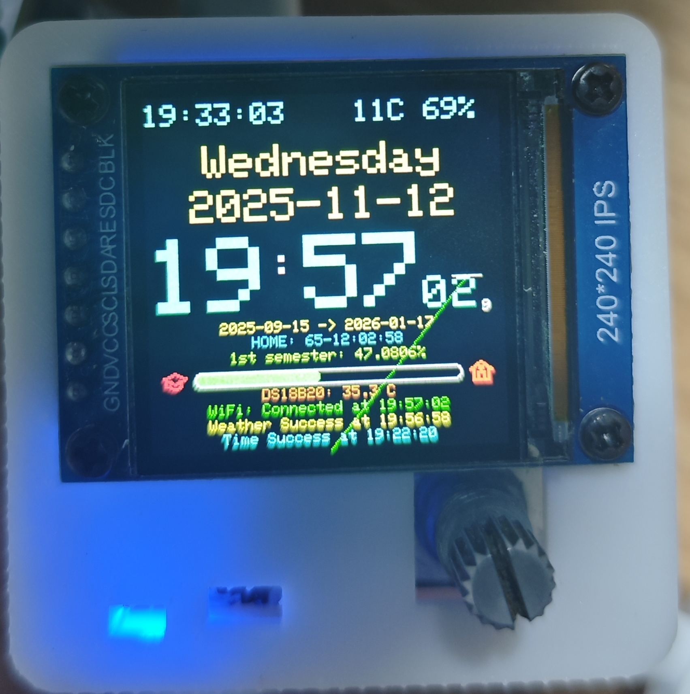
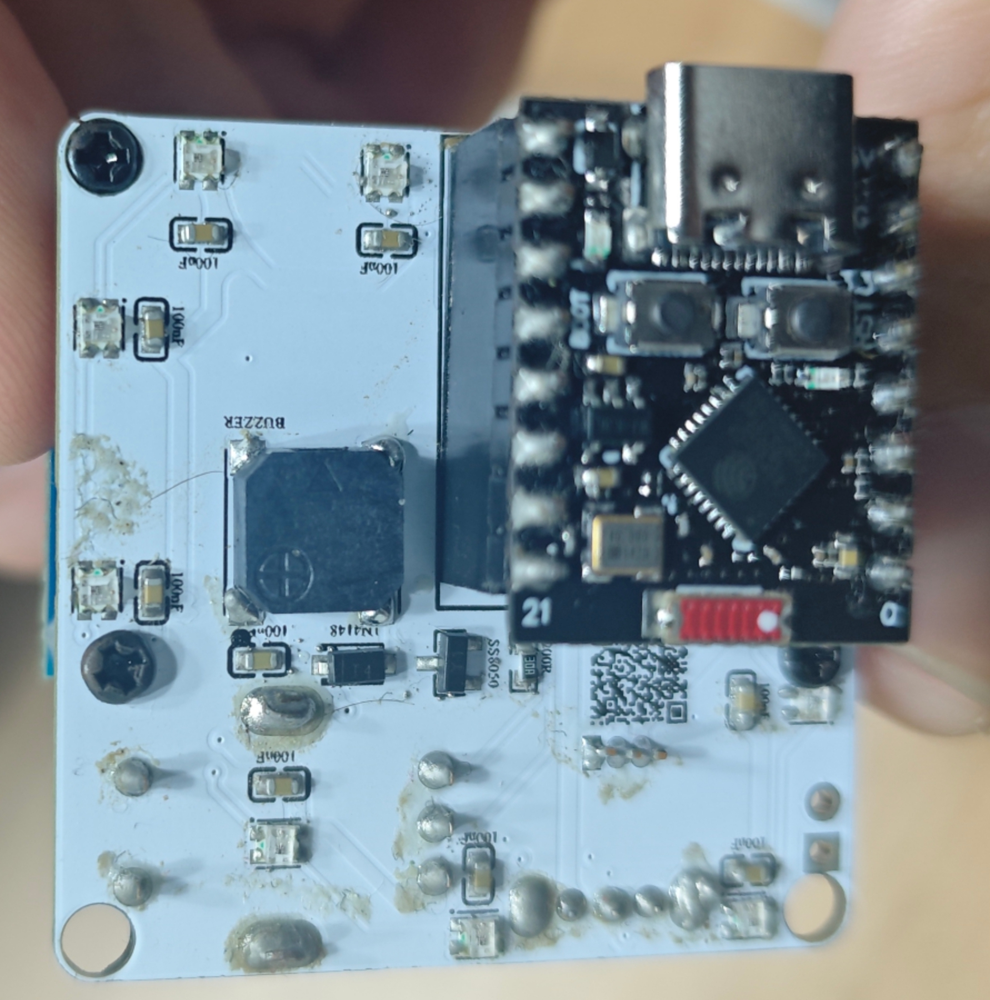

# 智能物联网(AIoT)系统设计期末大作业——实验报告

**项目名称：** AIoT多功能时钟
**团队：** 第十组

---

[TOC]

---

## 实物展示

正面

背面

## 功能概述

本项目设计并实现了一个基于 ESP32-C3 的多功能智能时钟，它通过 Wi-Fi 连接到华为云物联网平台，并可通过微信小程序进行交互。设备集成了多种实用和娱乐功能，详情如下。

本项目具有以下15个核心功能：

1. [时钟](#时钟)
2. [音乐](#音乐)
3. [互联网](#互联网)
4. [太空](#太空)
5. [闹钟](#闹钟)
6. [倒计时](#倒计时)
7. [番茄钟](#番茄钟)
8. [秒表](#秒表)
9. [简洁音乐](#简洁音乐)
10. [电脑性能监测](#电脑性能监测)
11. [温度监测](#温度监测)
12. [动画](#动画)
13. [游戏](#游戏)
14. [光照监测](#光照监测)
15. [LED设置](#led设置)

下面逐一进行介绍。

### 时钟

通过NTP协议连接阿里云NTP服务器`ntp.aliyun.com`同步网络时间，并由RTC模块维持走时。此外，设备能通过高德地图API获取实时天气信息，并提供了十七个不同风格的表盘可供用户选择。

### 音乐

使用板载无源蜂鸣器播放预置的单音轨音乐。播放界面可显示时长进度条、当前音符的频率和时长，以及频率随时间变化的动态图像。设备背面的彩色LED会同步呈现彩虹灯效。

用户可通过旋转编码器按键单击实现暂停和继续，也可从微信小程序通过华为云下发不同UI模式的播放音乐命令、转动编码器切换播放模式：单曲循环、列表循环、随机播放。设备内置88首乐曲，列表如下：

| ID  | 歌名                 | 演唱者 / 作曲者             |
|-----|----------------------|------------------------------|
| 0   | 爱你                 | 王心凌                      |
| 1   | 爱情讯息             | 陈奕迅                      |
| 2   | 啊朋友再见           | 无                          |
| 3   | 把回忆拼好给你       | 王贰浪                      |
| 4   | 保卫黄河             | 冼星海                      |
| 5   | 不得不爱             | 潘玮柏                      |
| 6   | 不再犹豫             | Beyond                      |
| 7   | 猜不透               | 丁当                        |
| 8   | 卡萨布兰卡           | Bertie Higgins              |
| 9   | 测谎                 | 薛之谦                      |
| 10  | 成都                 | 赵雷                        |
| 11  | 虫儿飞               | 黑鸭子                      |
| 12  | Counting Stars       | OneRepublic                 |
| 13  | 倒数                 | 蔡依林                      |
| 14  | 春娇与志明           | 五月天                      |
| 15  | 大海                 | 张雨生                      |
| 16  | 稻香                 | 周杰伦                      |
| 17  | 东方红               | 李有源                      |
| 18  | 东方之珠             | 罗大佑                      |
| 19  | 东西                 | 薛之谦                      |
| 20  | 梦中的婚礼           | Richard Clayderman          |
| 21  | 多远都要在一起       | 邓紫棋                      |
| 22  | 反方向的钟           | 周杰伦                      |
| 23  | Fate                 | Ludwig van Beethoven        |
| 24  | Five Hundred Miles   | The Innocence Mission       |
| 25  | For Elise            | Ludwig van Beethoven        |
| 26  | For Ya               | 来自网络                    |
| 27  | 富士山下             | 陈奕迅                      |
| 28  | 告白气球             | 周杰伦                      |
| 29  | 刚好遇见你           | 李玉刚                      |
| 30  | 歌唱祖国             | 王莘                        |
| 31  | 光辉岁月             | Beyond                      |
| 32  | 过火                 | 张信哲                      |
| 33  | 海阔天空             | Beyond                      |
| 34  | 荷塘月色             | 凤凰传奇                    |
| 35  | 红豆                 | 王菲                        |
| 36  | 红色高跟鞋           | 蔡健雅                      |
| 37  | 后来                 | 刘若英                      |
| 38  | 花海                 | 周杰伦                      |
| 39  | 江南                 | 林俊杰                      |
| 40  | 开始懂了             | 孙燕姿                      |
| 41  | 可不可以             | 张紫豪                      |
| 42  | 兰亭序               | 周杰伦                      |
| 43  | 梁祝                 | 何占豪 陈钢                 |
| 44  | 绿色                 | 陈雪凝                      |
| 45  | 明天会更好           | 群星                        |
| 46  | 南方姑娘             | 赵雷                        |
| 47  | 你若三冬             | 无                          |
| 48  | 怒放的生命           | 汪峰                        |
| 49  | Ode to Joy           | Ludwig van Beethoven        |
| 50  | 朋友                 | 周华健                      |
| 51  | 琵琶行               | 奇然                        |
| 52  | 平凡之路             | 朴树                        |
| 53  | 起风了               | 买辣椒也用券                |
| 54  | 七里香               | 周杰伦                      |
| 55  | 青花瓷               | 周杰伦                      |
| 56  | 晴天                 | 周杰伦                      |
| 57  | Radetzky Marsch      | Johann Strauss I            |
| 58  | 若水三千             | 无                          |
| 59  | 山丘                 | 李宗盛                      |
| 60  | Shape Of You         | Ed Sheeran                  |
| 61  | 十年                 | 陈奕迅                      |
| 62  | 送别                 | 李叔同                      |
| 63  | 素颜                 | 许嵩                        |
| 64  | Sugar                | Maroon 5                    |
| 65  | Take Me Hand         | 无                          |
| 66  | 天黑黑               | 孙燕姿                      |
| 67  | 童年                 | 罗大佑                      |
| 68  | Turkish March        | Wolfgang Amadeus Mozart     |
| 69  | 我怀念的             | 孙燕姿                      |
| 70  | 我是一只小小鸟       | 赵传                        |
| 71  | 喜欢你               | Beyond                      |
| 72  | 下个路口见           | 李宇春                      |
| 73  | 小苹果               | 筷子兄弟                    |
| 74  | 心墙                 | 郭静                        |
| 75  | 修炼爱情             | 林俊杰                      |
| 76  | 演员                 | 薛之谦                      |
| 77  | 一生有你             | 水木年华                    |
| 78  | 隐形的翅膀           | 张韶涵                      |
| 79  | 有点甜               | 汪苏泷                      |
| 80  | 遇见                 | 孙燕姿                      |
| 81  | 夜曲                 | 周杰伦                      |
| 82  | 鸳鸯戏               | 来自网络                    |
| 83  | 这世界那么多人       | 莫文蔚                      |
| 84  | 真的爱你             | Beyond                      |
| 85  | 追光者               | 岑宁儿                      |
| 86  | 最后一页             | 江语晨                      |
| 87  | Windows XP           | Microsoft                   |

### 互联网

此功能模块集成了20个子菜单，通过调用各类公共API获取并展示各种有趣的信息，包括：

1. 土味情话
2. 每日英语
3. 每日运势
4. 随机诗词
5. 随机对联
6. USD/RMB汇率
7. 随机单词
8. 每日一言
9. 励志短句
10. 优美诗句
11. 天气诗词
12. EMO话语
13. 脑筋急转弯
14. 健康小贴士
15. Github热榜
16. 历史上的今天
17. 十万个为什么
18. 详细天气
19. 股票行情 (AMD, Apple, NVIDIA, TESLA, Microsoft, Intel)
20. 全球汇率 (API暂时存在问题)

### 太空

从公共API获取与太空相关的数据，包括：
-   当前国际空间站（ISS）上的宇航员总人数及姓名。
-   当前国际空间站的实时经纬度坐标。

### 闹钟

支持用户在设备上直接设置闹钟，也可以通过华为云平台或微信小程序远程下发指令进行设置。在设备时间已经通过NTP同步的前提下，到达设定时间后，无论此时处在那个菜单，全局标志位都会将这个菜单强制退出，然后蜂鸣器会响起，播放音乐，同时屏幕展示闹钟响铃界面。

### 倒计时

标准倒计时功能。

### 番茄钟

遵循标准的番茄工作法：25分钟工作，5分钟短休息，4个循环后进行一次长休息。

### 秒表

标准秒表功能。

### 简洁音乐

与“音乐”功能类似，但UI界面更为简洁，专注于核心的音乐播放体验。

### 电脑性能监测

设备通过USB串口与电脑连接，接收并显示电脑的性能数据（CPU温度与负载、GPU温度与负载、内存占用率），同时将ESP32芯片自身的温度数据一同上报至华为云平台。

### 温度监测

使用DS18B20温度传感器获取环境温度，并通过`TFT_eWidget`库组件在屏幕上以仪表盘形式展示。数据同时会上报至华为云平台。

### 动画

一个移植并改编自`TFT_eSPI`库官方例程的动画效果展示。

### 游戏

内置了4款经典小游戏：
1. 康威生命游戏
2. 反应力小游戏
3. 掐时间小游戏
4. Flappy Bird

### 光照监测

通过光敏电阻检测环境光照强度，使用`TFT_eWidget`库组件的UI进行展示，并同时将数据上报至华为云平台。

### LED设置

允许用户直接在设备上设置背面WS2812 RGB LED的颜色和亮度，也支持通过华为云平台或微信小程序进行远程控制。

---

## 硬件选型

### 主控

考虑到项目对体积、性能和连接性的要求，主控选用 **ESP32-C3-SuperMini** 开发板。该板尺寸紧凑，自带 Wi-Fi 和蓝牙功能，性能足以满足本项目需求。为了方便开发和复用，设计中采用了排母连接，可将主控板模块化插拔。

### 屏幕

项目初期曾尝试使用FPC软排线连接的裸屏，但由于FPC座焊接难度高且不易固定，最终更换为带排针的 **1.69寸TFT屏幕模块**，方便连接和安装。

### 传感器

-   **温湿度传感器**: 原计划使用 **AHT20**，但因其焊盘过小且位于模块下方，手工焊接困难，最终未能成功。

-   **温度传感器**: 作为备用方案，采用了 **DS18B20** 单总线数字温度传感器，成功集成到电路中。

### 输入

选用 **EC11旋转编码器** 作为主要输入设备，其旋转和按压操作提供了良好的人机交互体验。

### 电源管理

原计划包含锂电池供电、**TP4056** 充电管理及USB/电池自动切换电路。但为降低项目复杂度和PCB尺寸，最终仅保留了原理图设计，实物采用USB直接供电。

### 无源蜂鸣器

考虑到体积限制，选用 **MLT-7525** 贴片无源蜂鸣器。

### RGB

选用 **WS2812** 可编程RGB LED，用于实现丰富的灯光效果。

---

## 电路原理图

### 主控

由于直接使用ESP32-C3-SuperMini开发板，无需设计复杂的外围电路，通过排母连接即可。

.png)

### 屏幕

屏幕通过排针与主控板的GPIO引脚连接。

### 传感器

#### AHT20
I2C接口电路，电源部分增加了去耦电容，SCL和SDA总线增加了上拉电阻。

.png)

#### DS18B20
单总线接口，数据引脚外接一个上拉电阻。

.png)

### 输入

EC11旋转编码器电路。

.png)

### 电源管理

#### 电源指示灯
.png)

#### 开关
用于控制主板对其他外设的供电。

.png)

#### 锂电池充电
基于TP4056的充电电路。

.png)

#### 降压电路
.png)

#### 电池电量
.png)

#### 电池接口
.png)

### 无源蜂鸣器

.png)

### RGB

.png)

### PCB

PCB设计时隐藏了铺铜层以清晰展示布线。实际制板时，顶层和底层均有大面积GND铺铜。

    
    

实物：

    
    

---

## 外壳结构

### 底部

底盖采用卡扣式设计，内层有抬高结构，无需螺丝即可与主体固定。底部中心预留了一个圆形槽，用于嵌入磁铁，方便设备吸附在金属表面。

    
    

### 主体

主体结构为编码器、USB接口、电源开关、电源指示灯和屏幕预留了精确的开口。内部设计了螺丝孔位，用于固定PCB板。

.png)

---

## 源代码

本项目所有源代码，包括硬件固件和微信小程序，均已开源托管于 GitHub。

**GitHub 仓库地址: [xiaomiao321/Aiot-project-ESP32C3](https://github.com/xiaomiao321/Aiot-project-ESP32C3)**

### 代码结构简介

-   **`Hardware/`**: 存放所有硬件相关的 PlatformIO 项目。
    -   `Weather_Clk_PlatformIO/`: **主固件项目**，实现了设备的全部功能。
    -   `Test_*/`: 开发过程中用于测试特定模块（如WIFI、屏幕、传感器）的独立项目。
-   **`SmallProgramme/`**: 存放微信小程序的前端代码。
    -   `Huawei_IOT_Wechat/`: 与硬件配套的微信小程序项目。

更详细的项目结构和编译指南，请参考仓库根目录下的 `README.md` 文件。